```bash
echo "He who is afraid of winter, shall not taste the warmth of summer"
```


## Certifications
- [AWS Certified Solutions Architect – Associate (SAA)](https://www.credly.com/badges/1fee2b08-ee31-45e3-8d9c-1a2826691757/public_url)
- [Dev Certified for Android](https://dev.id/certificate/verify/YNVM3Z80MX)
  
## Interests
- Mobile Development
- Full-Stack Development (TypeScript, .NET)
- Game Development

## Skills
- **Languages**: TypeScript, C#, JavaScript
- **Tools**: React, Node.js, .NET Core, Unity, AWS


<!---
Cydnirn/Cydnirn is a ✨ special ✨ repository because its `README.md` (this file) appears on your GitHub profile.
You can click the Preview link to take a look at your changes.
--->
